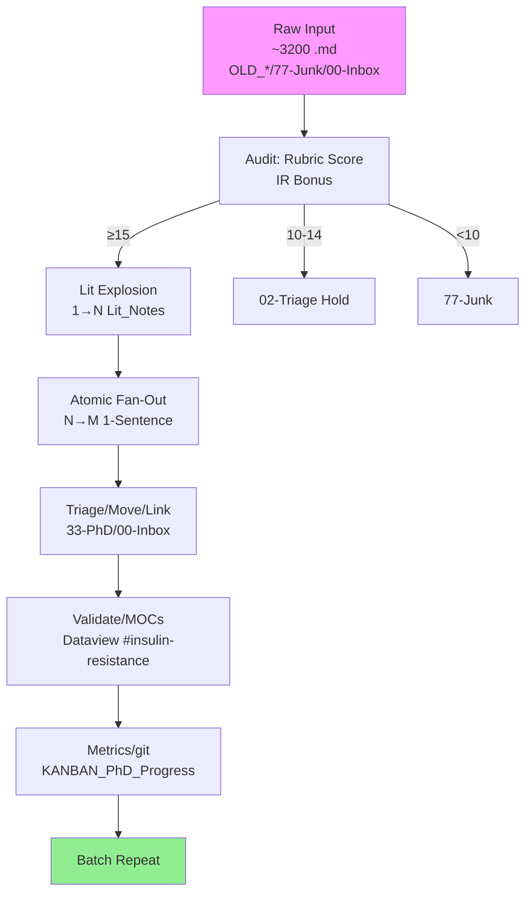

#atomic
---
uid: 20260211_Zettelkasten_Factory_Flow
date_created: 2026-02-11
date_modified: 2026-02-11
author: RON
source: RON Symbiosis Session
tags: #zettelkasten #phd-biomarker #vault-optimization #insulin-resistance #obsidian-para
status: approved
parent-moc: [[PhD_IR_MOC]], [[Inbox_Sprint_MOC]], [[Biomarkers_MOC]]
related: [[triage_rubric_2026-02-11]], [[Templates/11-Templates/Template_Lit_Note]], [[TEMPLATE_Atomic_Note]]

---

# Zettelkasten Factory Flow: Biomarker Digestion 🔬

**Atomic Goal**: ~3200 raw .md → 10k+ 1-sentence atomic gems (YAML/UID/tags/MOC-linked; PhD IR priority).

## Storyline (Luhmann Lab Analogy)
Raw notes = messy urine samples. Factory turns them into pure biomarkers.

1. **Intake Triage**: Rubric score (≥15 gold; 10-14 hold; <10 junk).
2. **Lit Dissection**: 1 raw → N Lit_Notes (DOI/quote/Tier1).
3. **Atomic Purification**: N Lit → M 1-sentence atomics.
4. **Hub Sort/Link**: Golds →33-Atomic; MOCs/Dataview.
5. **Metrics/Repeat**: KANBAN ticks; daily 100-batch cron.

## Mermaid Flowchart

**Scale**: Sub-agent batches; ronvault sync. **Approved 2026-02-11**.

**Backlinks**: [[88-Mocs/Zettelkasten_Story]] | [[22-Dashboards/KANBAN_PhD_Progress]]